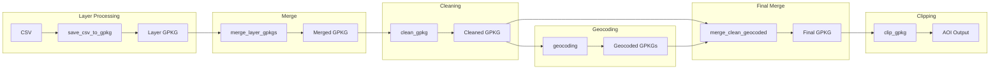

# 🧩 Snakemake Geospatial Processing Pipeline

This repository contains a **Snakemake pipeline** for processing geospatial datasets, starting from CSV files and producing cleaned, merged, geocoded, and optionally clipped GeoPackage (GPKG) outputs.

---

## 📌 Overview

The pipeline performs the following steps:

1. Convert raw CSV layers into GeoPackages
2. Merge all layers into a single GeoPackage
3. Clean the merged dataset
4. Perform geocoding on selected layers
5. Merge geocoded layers back into the dataset
6. Optionally clip the dataset to a bounding box (AOI)

---

## ⚙️ Configuration

The pipeline is driven by a `config.yaml` file.

### Required configuration fields:

* `gpkg`: path to the merged GeoPackage
* `gpkg_clean`: path to the cleaned GeoPackage
* `gpkg_clean_geocoded`: path to the final merged geocoded GeoPackage
* `aoi`: path to the clipped output GeoPackage
* `raw_layers`: list of input layers with:

  * `name`: layer name
  * `csv`: input CSV path
  * `metadata`: metadata file path
* `bbox` *(optional)*: bounding box for clipping
  Format: `[xmin, ymin, xmax, ymax]`

---

## 📂 Directory Structure

```
data/
├── raw/
│   ├── per_layer/         # Individual layer GPKGs
│   ├── *.gpkg             # Intermediate and final outputs
scripts/
├── csv_to_gpkg.py
├── merge_gpkgs.py
├── clean_ape.py
├── local_geocoding.py
├── merge_aoi.py
├── clip_to_bbox.py
Snakefile
config.yaml
```

---

## 🔄 Workflow Description

### 1. Convert CSV to GeoPackage

Each layer defined in `config.yaml` is converted into a GeoPackage.

* **Rule:** `save_csv_to_gpkg`
* **Input:** CSV + metadata
* **Output:** `data/raw/per_layer/{layer}.gpkg`

---

### 2. Merge Layer GeoPackages

All per-layer GeoPackages are merged into a single file.

* **Rule:** `merge_layer_gpkgs`
* **Output:** `config["gpkg"]`

---

### 3. Clean GeoPackage

The merged dataset is cleaned.

* **Rule:** `clean_gpkg`
* **Input:** merged GPKG
* **Output:** `config["gpkg_clean"]`

---

### 4. Geocoding (Selected Layers)

Geocoding is applied only to specific layers:

```python
layers_aoi = ["ace", "ape_dg"]
```

* **Rule:** `geocoding`
* **Input:** cleaned GPKG
* **Output:** `data/raw/{layer}_geocoded.gpkg`

---

### 5. Merge Geocoded Layers

Geocoded layers are merged back with the cleaned dataset.

* **Rule:** `merge_clean_geocoded`
* **Output:** `config["gpkg_clean_geocoded"]`

---

### 6. Optional Clipping to AOI

If a bounding box is provided in the config, the dataset is clipped.

* **Rule:** `clip_gpkg`
* **Input:** geocoded GPKG
* **Output:** `config["aoi"]`

If no `bbox` is specified, this step is skipped.

---

## 📊 Pipeline DAG

### High-Level DAG

```mermaid
graph TD
    A[CSV + Metadata per layer] --> B[save_csv_to_gpkg]
    B --> C[Per-layer GPKGs]
    C --> D[merge_layer_gpkgs]
    D --> E[Merged GPKG]
    E --> F[clean_gpkg]
    F --> G[Cleaned GPKG]
    G --> H[geocoding (selected layers)]
    H --> I[Geocoded layers]
    I --> J[merge_clean_geocoded]
    G --> J
    J --> K[Final GPKG]
    K --> L{bbox provided?}
    L -->|Yes| M[clip_gpkg]
    L -->|No| N[Skip clipping]
    M --> O[AOI GPKG]
```

---

### Detailed Rule Dependencies



---

## ▶️ Running the Pipeline

Run the full pipeline with:

```bash
snakemake --cores 1
```

Or specify more cores:

```bash
snakemake --cores N
```

To visualize the DAG directly from Snakemake:

```bash
snakemake --dag | dot -Tpng > dag.png
```

---

## 📦 Outputs

The pipeline produces:

* Per-layer GeoPackages
* Merged GeoPackage
* Cleaned dataset
* Geocoded layers
* Final merged geocoded dataset
* AOI-clipped dataset *(optional)*

---

## 🛠️ Dependencies

* Python 3
* Snakemake
* Geospatial libraries (e.g., `geopandas`, `fiona`, `shapely`)
* Script-specific dependencies in `scripts/`

---

## 💡 Notes

* The pipeline is fully **config-driven**
* Each step is modular and implemented via Python scripts
* Clipping is optional and depends on the presence of `bbox`
* Geocoding is applied only to selected layers
