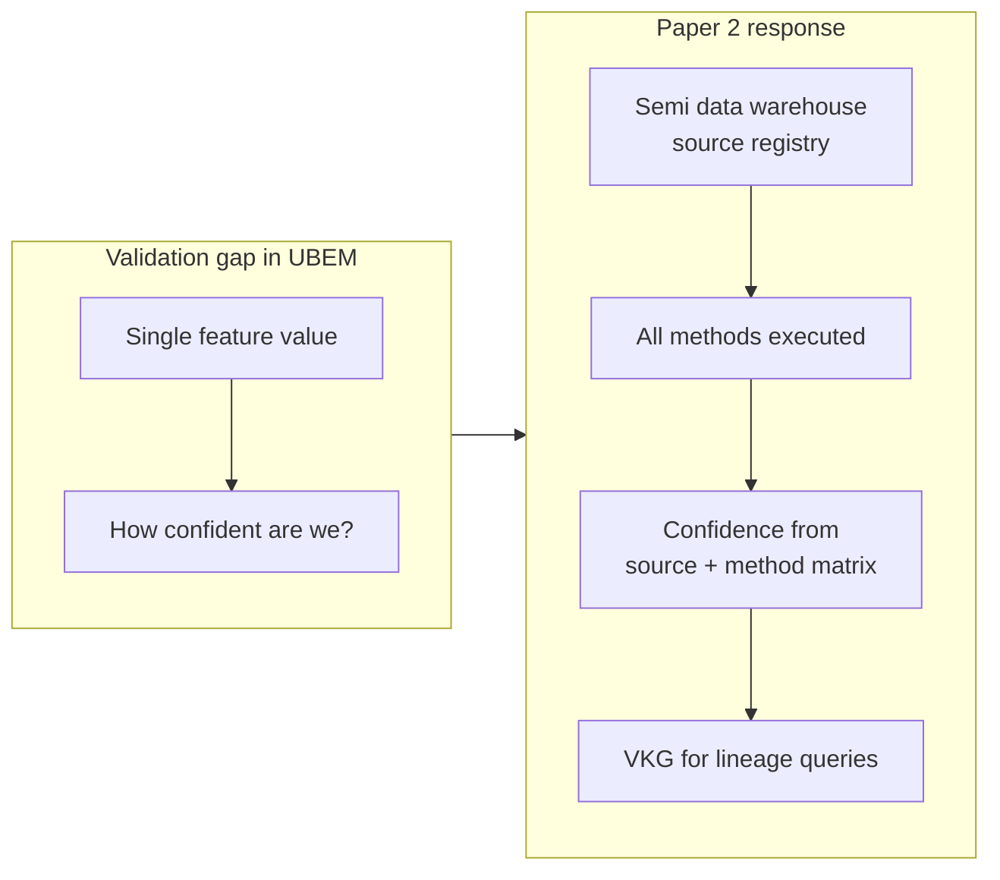
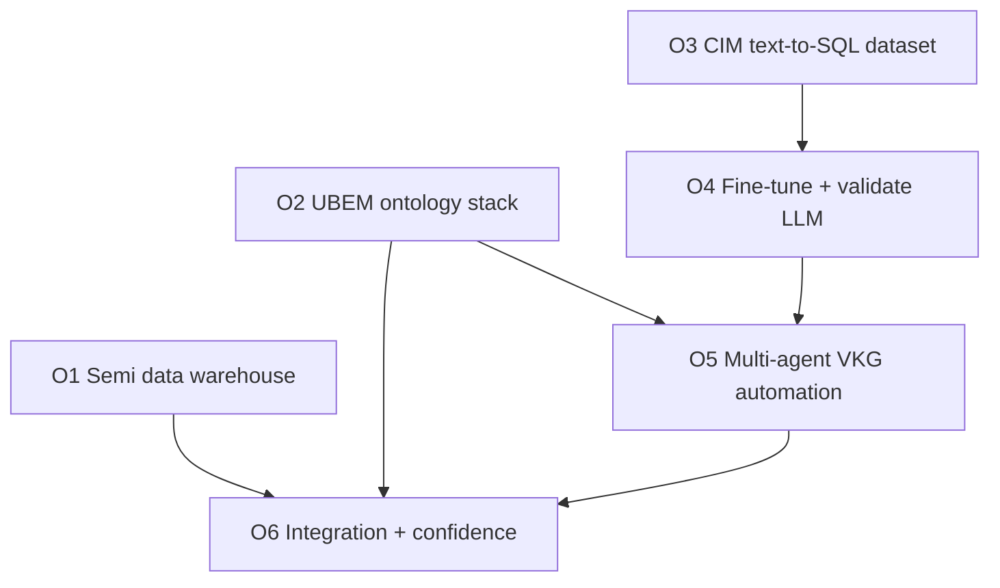
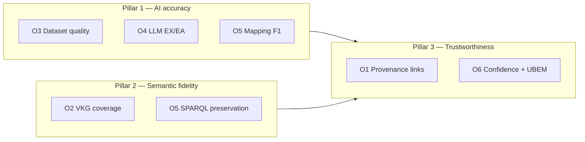
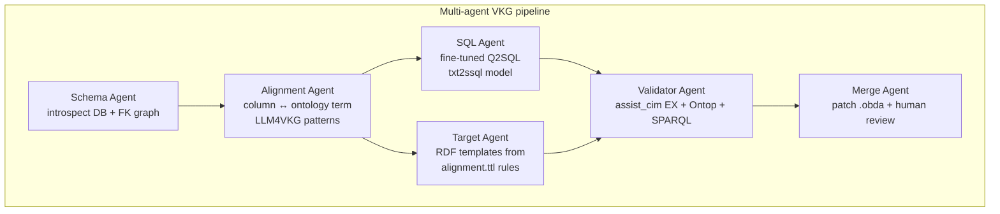
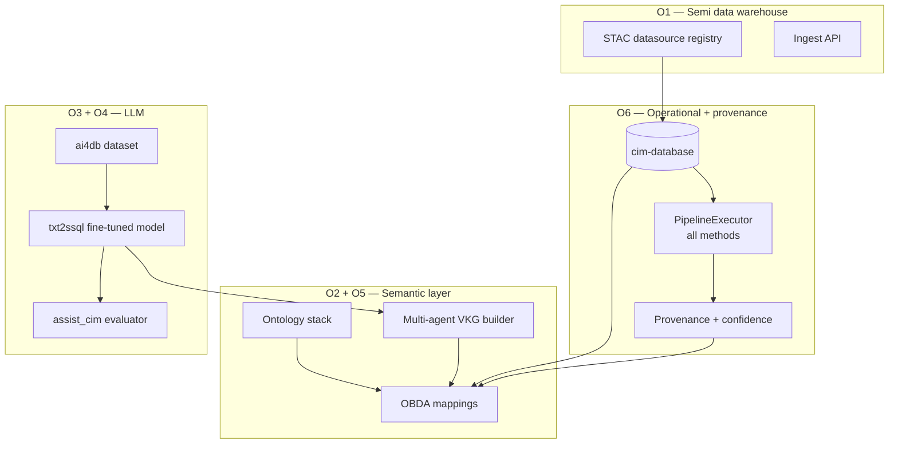
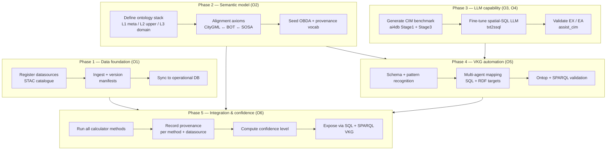
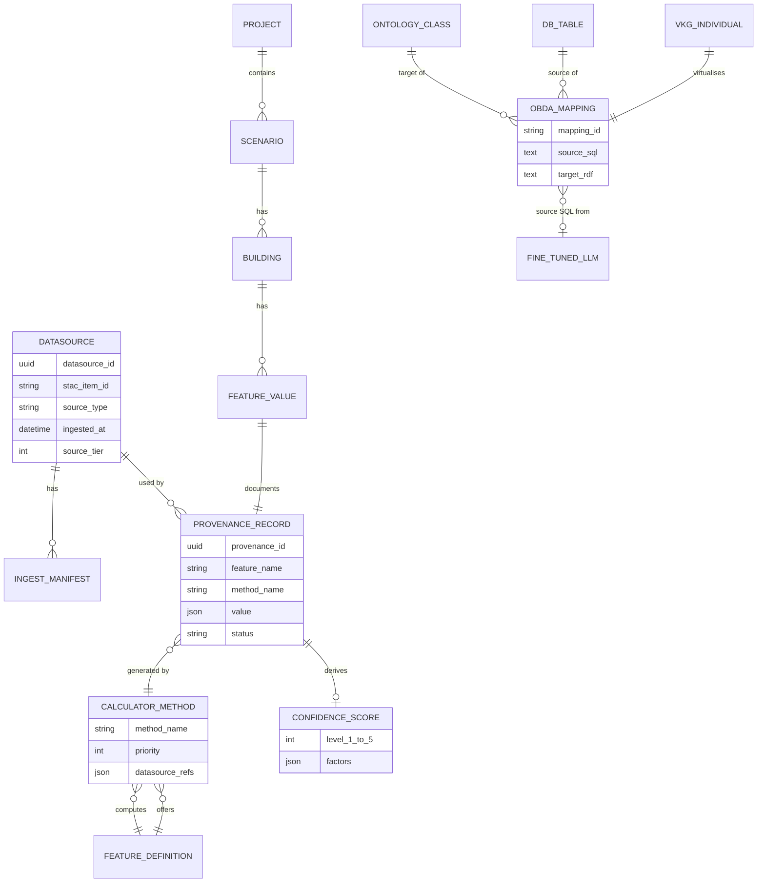
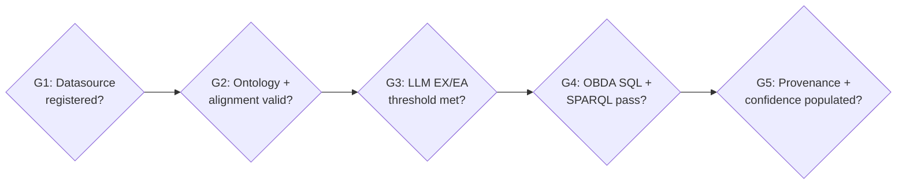

# Paper 2 — Outline (Markdown draft)

> **Status:** Objectives + per-objective literature review defined. Expand subsections into prose, then migrate to `paper2/latex/main.tex` on Overleaf.

---

## Title (candidates)

1. **Confidence-Aware Urban Building Modeling via a Semi Data Warehouse, Ontology Stack, and LLM-Automated Virtual Knowledge Graph**
2. **Validating CIM Wizard by Provenance and Method Confidence: Integrating Data Warehousing, UBEM Ontologies, and Fine-Tuned Text-to-SQL for VKG Automation**
3. **CIM Wizard 2.0: From Priority Fallback to Multi-Method Provenance with Automated Semantic Virtualisation**

**Short name:** CIM Wizard 2.0 / Confidence-aware CIM

---

## Authors & affiliations

- [TBD]
- Politecnico di Torino — Energy Center

---

## Central problem & north star

**Urban building and energy models are difficult to validate.** At city scale we rarely have ground-truth labels for every building attribute (height, type, U-value proxies, occupancy, consumption). Models therefore mix **measured**, **inferred**, and **simulated** inputs — but users still receive a **single number** without knowing how trustworthy it is.

**Paper 1 (CIM Wizard baseline):** calculators run methods in **priority order**; the first successful method wins. One value per feature is stored for the baseline scenario. Provenance is implicit.

**Paper 2 (this work):** we cannot always prove correctness, but we can make outputs **auditable** and **comparable** by:

1. Registering every **data source** in a semi data warehouse.
2. Running **all defined methods** per feature (not only the priority winner).
3. Recording **methodology + datasource lineage** for each result.
4. Assigning a **confidence level** derived from source quality, method agreement, and data availability.
5. Exposing lineage through an **ontology-backed Virtual Knowledge Graph** (VKG) built with **LLM-assisted OBDA**.



**Hypothesis:** *Structured provenance + multi-method comparison + semantic querying is a practical substitute for full ground-truth validation in urban modeling — enabling sensitivity analysis and confidence scoring until accuracy can be improved with better measurements.*

---

## Research objectives (O1–O6)

Each objective has a **definition**, **implementation anchor** in the monorepo, **literature review** (§2), and **evaluation criteria**.

| ID | Objective | Repo / artefact | Success criterion |
|----|-----------|-----------------|-------------------|
| **O1** | Create a **semi data warehouse** for CIM Wizard datasources | `datalake/` | Datasources registered with STAC metadata; ingest + discovery API |
| **O2** | Create an **ontology stack for UBEM** | `semantic/ontop/` | Layered TBox (meta / upper / domain); alignment across CityGML, BOT, SOSA, GeoSPARQL |
| **O3** | Create a **CIM-scoped dataset** to fine-tune text-to-SQL | `ai4db/` | 88K+ question–SQL pairs; task/domain taxonomy; spatial + multi-schema coverage |
| **O4** | **Fine-tune and validate** spatial-SQL LLMs | `txt2ssql/`, `assist_cim/` | EX ≥ 85%, EA ≥ 90% on CIM benchmark (`evaluator_v2.py`) |
| **O5** | **Multi-agent system** to automate VKG / OBDA mapping (fine-tuned LLM + literature patterns) | planned + `semantic/SEMANTIC-plan.md` | Draft `.obda` passes SQL execution + Ontop + SPARQL smoke tests |
| **O6** | **Integrate** warehouse + auto-VKG into CIM Wizard for **provenance & confidence** | `cim_wizard_integrated_2026/` | All methods run; provenance + confidence per `(building, feature, method)`; queryable via SQL/SPARQL |

**Dependency graph:**



---

### Objectives — quantitative reframing (evaluation path)

> **How to read this block:** the table above states **what we build** (engineering objectives).  
> The tables below state **what we must prove** (research hypotheses + metrics + baselines).  
> Use both when writing the paper: implementation in Methods, numbers in Results.

#### Evaluation template (apply to every objective)

| Field | Question to answer |
|-------|-------------------|
| **Hypothesis (H)** | What measurable claim do we test? |
| **Baseline (B)** | What do we compare against? |
| **Metric (M)** | What number(s) do we report? |
| **Dataset (D)** | On what data do we measure? |
| **Success threshold** | What counts as supporting the hypothesis? |

#### Hypotheses mapped to O1–O6

| ID | Hypothesis | Baseline | Primary metrics | Dataset | Target (illustrative) |
|----|------------|----------|-----------------|---------|------------------------|
| **H1** (O1) | Warehouse-backed lineage increases attributable provenance without unacceptable ingest overhead | Direct ingest to `cim_*` without `datasource_id` | Provenance link rate; ingest success rate; ingest time per 1k features | Case-study datasources + full pipeline run | Link rate ↑ ≥ X%; overhead ≤ Y% |
| **H2** (O2) | UBEM ontology VKG faithfully virtualises CIM operational schemas | Raw SQL over same PostgreSQL tables | Schema coverage %; SPARQL answer preservation (F1); query success rate; p95 latency | `test-queries.sparql` + held-out SQL ground truth | F1 ≥ Z; 100% smoke queries pass |
| **H3** (O3) | CIM benchmark is large, diverse, and executable | Generic benchmarks (Spider/BIRD subset) or ad-hoc queries | # pairs; taxonomy balance; gold SQL executability %; spatial function coverage | `ai4db` train/val/test splits | ≥88K pairs; executability ≥ 99% |
| **H4** (O4) | Fine-tuned CIM spatial-SQL LLM beats general models on PostGIS tasks | GPT-4o-mini / SQLCoder-7B zero-shot; optionally Paper-1 manual SQL | EM, EX, Deep EM, SC, EA (`evaluator_v2.py`); ΔEX vs baseline | `benchmark_generator_v2` held-out set | EX ≥ 85%; EA ≥ 90%; ΔEX ≥ +10 pp |
| **H5** (O5) | Multi-agent OBDA reduces authoring effort while preserving mapping correctness | Manual `cim_citydb.obda`; BootOX/Ontop direct; generic LLM (no fine-tune) | Mapping F1; source SQL EX; SPARQL preservation; automation rate (% accepted w/o edit); time per mapping | Gold OBDA subset (N mappings); RODI-style holdout | F1 ≥ 0.7; automation rate ≥ 60% |
| **H6** (O6) | Confidence scores are informative when ground truth is partial | Paper 1 priority-only single value; random confidence assignment | Provenance coverage; method agreement rate; Spearman ρ(confidence, spread); calibration on truth subset; UBEM stock sensitivity | Case-study city; optional LiDAR/OSM/meter subset | ρ ≤ −0.5; low-confidence filter changes stock less than random filter |

#### Per-objective metric detail

**O1 — Semi data warehouse**

| Metric | Formula / definition |
|--------|---------------------|
| Provenance link rate | `records with resolvable datasource_id / total provenance records` |
| Metadata completeness | `filled STAC required fields / required fields` |
| Ingest success rate | `successful ingests / attempted ingests` |
| Ingest overhead | `T_warehouse_ingest − T_direct_ingest` per 1k features |

**O2 — UBEM ontology stack**

| Metric | Formula / definition |
|--------|---------------------|
| Schema coverage | `mapped tables+columns / relevant DB schema elements` |
| SPARQL answer preservation | F1 comparing VKG SPARQL results vs gold SQL results (LLM4VKG-style) |
| Query success rate | `passing queries / test-queries suite` |
| Query latency | p50 / p95 SPARQL-to-SQL execution time |

**O3 — CIM text-to-SQL dataset**

| Metric | Formula / definition |
|--------|---------------------|
| Dataset size | # question–SQL pairs (train / val / test) |
| Taxonomy balance | min count per task type & domain type; Shannon entropy |
| Gold executability | `% benchmark SQL that runs without error on live DB` |
| Difficulty spread | % samples per complexity level (1/2/3) |

**O4 — Fine-tuned LLM** (already implemented in `assist_cim/evaluator_v2.py`)

| Metric | Formula / definition |
|--------|---------------------|
| EM | Exact string match of generated vs gold SQL |
| EX | Execution accuracy (result-set match) |
| Deep EM | Structural match (tables, joins, spatial functions) |
| SC | Semantic correctness (execution + structure + non-empty) |
| EA | Accuracy after agentic self-correction loops |
| **Required ablations** | Q2SQL vs Q2Inst+QInst2SQL; with/without schema prompt; 14B vs 32B |

**O5 — Multi-agent VKG automation**

| Metric | Formula / definition |
|--------|---------------------|
| Mapping F1 | TP/FP/FN over mapping elements vs gold `.obda` |
| Source SQL EX | `% generated source SQL executes and returns expected rows` |
| SPARQL preservation | answer F1 on benchmark queries: auto-OBDA vs gold-OBDA |
| Automation rate | `% mapping blocks accepted without manual edit` |
| Authoring effort | median time to produce N mappings (manual vs agent-assisted) |

**O6 — Integration, provenance & confidence** (headline quantitative contribution)

| Category | Metric | Formula / definition |
|----------|--------|---------------------|
| Completeness | Method coverage | `% configured methods actually executed` |
| Completeness | Provenance coverage | `% (building, feature) pairs with full lineage record` |
| Disagreement | Agreement rate @ τ | `% buildings where all methods agree within tolerance τ` |
| Disagreement | MAD per feature | median absolute deviation across methods |
| Disagreement | Conflict rate | `% buildings with spread > τ` |
| Confidence | Spearman ρ | correlation(confidence level, cross-method spread) — expect negative |
| Calibration | Calibration error | on truth subset: \|confidence − (1 − normalised error)\| |
| Downstream | Stock UBEM sensitivity | `% Δ annual demand when swapping method A vs B` |
| Downstream | Low-confidence filter utility | demand change excluding confidence ≤ 2 vs excluding random 20% |

**Suggested tolerances τ (case study — calibrate):**

| Feature | Agreement tolerance τ |
|---------|----------------------|
| `building_height` | ±2 m |
| `building_area` | ±10% |
| `building_type` | exact match |
| `building_volume` | ±15% |

**Ground-truth subsets for calibration (use at least one):**

- Buildings with both raster height and OSM height tag
- Small field/LiDAR reference sample (even 50–100 buildings)
- Metered / EPC buildings if available in case-study DB

#### Three evaluation pillars (paper Results spine)

Group objectives so Results is not a pipeline tour:

| Pillar | Objectives | What reviewers see |
|--------|------------|-------------------|
| **P1 — AI accuracy** | O3, O4, O5 | Dataset stats; EX/EA tables; mapping F1; ablations |
| **P2 — Semantic fidelity** | O2, O5 | Schema coverage; SPARQL preservation; query latency |
| **P3 — Trustworthiness** | O1, O6 | Provenance coverage; disagreement; confidence calibration; UBEM sensitivity |



#### Planned results tables (minimum set)

| Table | Content | Pillar |
|-------|---------|--------|
| **T1** | CIM dataset statistics (size, taxonomy, executability) | P1 |
| **T2** | LLM benchmark by task/domain/complexity (EX, EA) | P1 |
| **T3** | Fine-tuned vs baselines + ablations (ΔEX) | P1 |
| **T4** | OBDA automation vs manual/gold (F1, automation rate) | P1/P2 |
| **T5** | VKG schema coverage + SPARQL preservation | P2 |
| **T6** | Provenance coverage + method disagreement by feature | P3 |
| **T7** | Confidence calibration + UBEM stock sensitivity | P3 |

#### What to avoid in the paper

- Reporting only that six modules were implemented (no baselines).
- Binary pass/fail gates only (G1–G5) without continuous metrics.
- Defining confidence levels without testing correlation or downstream utility.
- Case study maps without summary statistics (agreement %, ρ, stock Δ).

---

## Abstract (draft bullets — expand to ~250 words)

- UBEM and city-scale energy twins lack ground-truth validation for most building attributes.
- CIM Wizard (Paper 1) computes features via priority-based calculator methods but stores only one result and hides alternatives.
- We define **six objectives**: semi data warehouse (O1), UBEM ontology stack (O2), CIM text-to-SQL dataset (O3), fine-tuned LLM validation (O4), multi-agent VKG automation (O5), integration with **confidence-aware provenance** (O6).
- Contributions: STAC-aligned warehouse (`datalake/`), three-layer ontology + OBDA (`semantic/`), spatial-SQL benchmark pipeline (`ai4db` → `txt2ssql` → `assist_cim`), LLM-assisted OBDA inspired by LLM4VKG, multi-method execution with confidence scoring.
- Case study: [TBD] — method disagreement maps, provenance subgraphs, SPARQL lineage queries.
- **Keywords:** urban building energy modeling, data provenance, confidence scoring, semi data warehouse, STAC, ontology, virtual knowledge graph, OBDA, text-to-SQL, PostGIS

---

## 1. Introduction

### 1.1 Motivation — why confidence, not only accuracy?

- City-scale models aggregate thousands of buildings; **field validation of every attribute is infeasible**.
- Practitioners need to know: *Was this height from LiDAR or a default? Did two methods agree?*
- **Confidence** (from source tier + method agreement + input completeness) supports decisions until measured data improves accuracy.

### 1.2 From Paper 1 to Paper 2

| Aspect | Paper 1 | Paper 2 |
|--------|---------|---------|
| Methods | Priority fallback | **All methods** (O6) |
| Output | One value / feature | Value matrix + **provenance + confidence** |
| Data inputs | Ad hoc schemas | **Warehouse registry** (O1) |
| Semantics | SQL/REST | **UBEM ontology + VKG** (O2, O5) |
| SQL generation | Manual | **Fine-tuned LLM** (O3, O4) |
| OBDA | Manual `.obda` | **Multi-agent automation** (O5) |

### 1.3 Research questions (mapped to objectives)

| RQ | Question | Objective |
|----|----------|-----------|
| RQ1 | How to catalogue heterogeneous geospatial datasources for UBEM pipelines? | O1 |
| RQ2 | Which ontology layers best support building energy + observation + geometry integration? | O2 |
| RQ3 | How to build a domain-specific text-to-SQL training set for PostGIS multi-schema queries? | O3 |
| RQ4 | Do fine-tuned LLMs outperform general models on CIM spatial SQL? | O4 |
| RQ5 | Can agents automate OBDA mapping using fine-tuned SQL + ontology patterns? | O5 |
| RQ6 | Can provenance + confidence improve trust in CIM Wizard without full ground truth? | O6 |

### 1.4 Contributions (by objective)

1. **O1** — CIM semi data warehouse design: STAC registry, ingest API, datasource versioning (`datalake/`).
2. **O2** — Three-layer UBEM ontology stack with cross-vocabulary alignment (`semantic/ontop/`).
3. **O3** — Taxonomy-structured CIM spatial-SQL benchmark (`ai4db/`: Stage 1 rules + Stage 3 LLM augmentation).
4. **O4** — Fine-tuned Qwen/Llama models + unified evaluator (`txt2ssql/ftv2`, `assist_cim/evaluator_v2.py`).
5. **O5** — Multi-agent VKG construction pipeline combining LLM4VKG patterns, fine-tuned Q2SQL, and template-based RDF targets.
6. **O6** — Provenance-aware multi-method CIM Wizard integration with **confidence scoring** model.

### 1.5 Paper organisation

- §2 Literature review **per objective** (O1–O6)
- §3 Overall architecture
- §4 **High-level methodology schema** (phases, data flow, validation gates)
- §5–9 Methodology detail (one section group per objective)
- §10 Case study **with quantitative evaluation** (hypotheses H1–H6, pillars P1–P3, tables T1–T7)
- §11 Discussion & §12 Conclusion

---

## 2. Literature review by objective

> Each subsection: **definitions** → **prior work** → **gap** → **our position**.

---

### 2.1 O1 — Semi data warehouse, data lake, STAC (§2.1)

#### 2.1.1 Definitions

| Term | Definition (for this paper) |
|------|----------------------------|
| **Data lake** | Storage of raw/semi-structured data in native formats; schema-on-read; weak upfront modelling (Inmon/Zhamak debates). |
| **Data warehouse** | Structured, integrated, subject-oriented store optimised for analytics; schema-on-write. |
| **Semi data warehouse** | *Our term:* catalogue + metadata discipline of a warehouse, but retains heterogeneous/raw payloads and late binding — suited to mixed UBEM inputs (vectors, rasters, APIs, files). |
| **STAC** (SpatioTemporal Asset Catalog) | JSON catalogue standard for geospatial assets: Item, Collection, Catalog; enables discovery by space/time. |
| **FAIR** | Findable, Accessible, Interoperable, Reusable — principles for research data management. |

#### 2.1.2 Prior work & similar projects

| Work / project | Relevance to O1 |
|----------------|-----------------|
| **STAC specification** (radiantearth) | Metadata model for `datalake/models/datasource.py` |
| **SpatioTemporal Asset Catalog on COG** | Raster/vector asset patterns for DTM/DSM |
| **openEO**, **OGC API — Features / Records** | API-based datasource ingestion |
| **MetaCarto / STAC Index** | Federated catalogue discovery |
| **Google Earth Engine catalog** | Large-scale geospatial asset registry (conceptual parallel) |
| **Microsoft Planetary Computer STAC** | Production STAC + analytics |
| **SenML**, **OGC SensorThings API** | IoT / sensor datasource patterns (link to O6 provenance) |
| **Data lakehouse** (Delta/Iceberg) | Hybrid lake+warehouse — compare/contrast with our *semi* approach |
| **ISO 19115 / DCAT** | Geographic and data catalogue metadata standards |

#### 2.1.3 Gap

- UBEM pipelines rarely expose a **unified datasource registry** with stable IDs back-linked from feature calculators.
- STAC is widespread for earth observation; less adopted for **building stock + census + grid + user uploads** in one CIM catalogue.

#### 2.1.4 Our position (O1)

- `datalake/` implements a **CIM semi data warehouse**: STAC Items + `dl4r:` extension, ingest API, `datasource_id` for provenance (O6).
- Not a full enterprise warehouse ETL; focused on **registration, versioning, and lineage** for modeling inputs.

---

### 2.2 O2 — Ontology stack for UBEM (§2.2)

#### 2.2.1 Definitions

| Term | Definition |
|------|------------|
| **UBEM** | Urban Building Energy Modeling — city-scale simulation of building stock energy use. |
| **CIM** | City Information Model — spatial + semantic container for digital twin cities. |
| **Ontology stack** | Layered vocabularies: meta (RDF/OWL), upper (BFO/DOLCE), domain (CityGML, BOT, Brick). |
| **OBDA / VKG** | Ontology-Based Data Access; virtual RDF graph over relational DB via mappings. |

#### 2.2.2 Prior work

| Paper / standard | Contribution | Link to O2 |
|------------------|--------------|------------|
| **Shi et al. (2023)** — *Advanced Engineering Informatics* | OntoCIM: BIM-GIS-IoT ontology; five-step integration; SPARQL apps | CIM upper pattern; application ontology extension |
| **Wu et al. (2023)** — *Energy & Buildings* | Ontology BEM: Brick + BOT; thermal zoning; IDF translation | HVAC + topology for single-building BEM |
| **Ma et al. (2024)** — *Sustainable Cities and Society* | BTO + UBO; city-scale EnergyPlus; GeoSPARQL in UBO | UBEM templates + instances at scale |
| **CityGML / 3DCityDB** | Urban object model + DB schema | `citydb.*`, `citygml2.owl` |
| **BOT** (Rasmussen et al.) | Building topology | `bot:Building`, `bot:Space`, `bot:containsZone` |
| **Brick** | HVAC equipment semantics | Future HVAC provenance |
| **SOSA / SSN** | Observations, sensors, FOI | Energy KPIs as `sosa:Observation` |
| **GeoSPARQL** | Geometry in RDF | `geo:asWKT` in OBDA |
| **OWL-Time** | Temporal entities | Time series periods |
| **ifcOWL / buildingSMART** | BIM semantics on IFC | Complement to CityGML |
| **PROV-O** | Provenance ontology | O6 confidence lineage in VKG |

#### 2.2.3 Gap

- Papers propose **ontology-centric pipelines** but not integrated with **operational CityDB + calculator provenance + LLM-maintained OBDA**.
- No unified **three-layer stack** wired to CIM Wizard schemas and confidence model.

#### 2.2.4 Our position (O2)

- Three layers documented in `semantic/SEMANTIC-plan.md`:
  - **L1 Meta:** RDF, RDFS, OWL, SKOS, schema.org, Dublin Core
  - **L2 Upper:** BFO, SUMO, DOLCE (planned)
  - **L3 Domain:** GeoSPARQL, OWL-Time, BOT, SOSA/SSN, CityGML, `cim:` extension
- `alignment.ttl` bridges CityGML ↔ BOT ↔ GeoSPARQL ↔ SOSA.
- `cim_citydb.obda` materialises VKG over operational DB.

---

### 2.3 O3 — CIM-scoped text-to-SQL dataset (§2.3)

#### 2.3.1 Definitions

| Term | Definition |
|------|------------|
| **Text-to-SQL** | NL question → SQL query over a fixed schema. |
| **Spatial SQL** | PostGIS-extended SQL (`ST_*` functions, `GEOMETRY` types). |
| **Benchmark** | Paired (question, SQL, metadata) with execution ground truth. |

#### 2.3.2 Prior work

| Work | Relevance |
|------|-----------|
| **Spider**, **WikiSQL** | General text-to-SQL; no PostGIS |
| **BIRD** | Large cross-domain DB benchmark |
| **GeoQuery**, **SpatialQA** | Early geo-NL interfaces |
| **SparC**, **KaggleDBQA** | Complex multi-turn / domain DBs |
| **SeaView**, geospatial NL benchmarks | Limited multi-schema PostGIS |
| **This project `ai4db/`** | CIM-specific: 18 task types, 5 domain types, census+network+raster |

#### 2.3.3 Gap

- No public benchmark covers **CIM Wizard multi-schema PostGIS** (`cim_vector`, `cim_census`, `cim_network`, `cim_raster`) with **taxonomy labels** (complexity, frequency).
- OBDA-shaped SQL (mapping-friendly `SELECT` with join keys) not in generic benchmarks.

#### 2.3.4 Our position (O3)

- `stage1_cim_v2.py` — rule-based generator with task + domain taxonomy.
- `stage3_v2.py` — LLM augmentation (paraphrase, sql_rewrite, question_to_sql).
- `merge_datasets.py`, `curator.py`, `generate_negative_samples.py` — training hygiene.
- `benchmark_generator_v2.py` — stratified evaluation sets.
- **Extension planned:** `citydb` / `ng2_*` + OBDA-source SQL templates for O5.

---

### 2.4 O4 — Fine-tune LLM and validate (§2.4)

#### 2.4.1 Definitions

| Metric | Definition (`assist_cim/evaluator_v2.py`) |
|--------|------------------------------------------|
| **EM** | Exact Match — string equality of SQL |
| **EX** | Execution Accuracy — result set match |
| **Deep EM** | Structural SQL correctness (tables, spatial functions) |
| **SC** | Semantic Correctness — execution + structure + non-empty |
| **EA** | Eventual Accuracy — after agentic self-correction loops |

#### 2.4.2 Prior work

| Work | Relevance |
|------|-----------|
| **SQLCoder**, **DIN-SQL**, **DAIL-SQL** | LLM text-to-SQL methods |
| **CodeLlama / Qwen2.5-Coder** | Code-capable base models |
| **LoRA / QLoRA** | Efficient domain fine-tuning (`txt2ssql/ftv2`) |
| **Unsloth** | Fast 32B fine-tuning |
| **LangGraph SQL agents** | `agent_cim_assist.py` — tool use + repair |
| **Hofer et al. (ESWC 2024)** | LLM-generated RML mappings — related eval mindset |

#### 2.4.3 Gap

- General models fail on **schema-qualified PostGIS** and **raster–vector joins**.
- Few studies report **taxonomy-stratified** EX on urban energy schemas.

#### 2.4.4 Our position (O4)

- Models: Qwen 2.5 14B/32B, Llama 3.1 14B (`txt2ssql/ftv2/`).
- Architectures: Q2SQL (direct), Q2Inst + QInst2SQL (two-stage).
- Dataset: HuggingFace `taherdoust/txt2ssql_20july2025`.
- Evaluation: `evaluator_v2.py` with task/domain/complexity breakdown.
- Target: **EX ≥ 85%**, **EA ≥ 90%** on held-out CIM benchmark.

---

### 2.5 O5 — Multi-agent VKG / OBDA automation (§2.5)

#### 2.5.1 Definitions

| Term | Definition |
|------|------------|
| **VKG** | Virtual Knowledge Graph — RDF interface over SQL sources without full materialisation. |
| **OBDA mapping** | Pair `(source SQL, target RDF template)` in Ontop `.obda`. |
| **Mapping patterns** | SE, SR, SRm, SH (Calvanese et al. / LLM4VKG). |

#### 2.5.2 Prior work

| Work | Relevance |
|------|-----------|
| **LLM4VKG** (Xiao et al., IJCAI 2025) | LLM + mapping patterns for VKG bootstrap; RODI benchmark |
| **BootOX**, **IncMap**, **Ontop direct mapping** | Rule-based / semi-automatic OBDA |
| **Bereta & Koubarakis (2016)** | Ontop of geospatial DBs — `ST_AsText`, GeoSPARQL literals |
| **GeoTriples** (Kyzirakos et al.) | Geospatial R2RML with user revision |
| **From SQL to KG — multi-agent** (OpenReview) | Multi-agent ETL + graph construction |
| **Lembo et al. (2017)** | OBDA specification evolution / repair |
| **Hofer et al.** | LLM RML — not Ontop lifecycle |

#### 2.5.3 Gap

- LLM4VKG: strong bootstrap, **no domain PostGIS fine-tuning**, no **provenance-aware** targets, no **CIM ontology stack**.
- No multi-agent loop combining **fine-tuned Q2SQL** + **ontology template engine** + **Ontop validation**.

#### 2.5.4 Our position (O5) — planned multi-agent architecture



| Agent | Input | Output |
|-------|-------|--------|
| Schema | `information_schema`, sample stats | DB graph `G_Σ` |
| Alignment | `G_Σ`, seed ontology O2 | SE/SR/SRm/SH instances + property matches |
| SQL | Mapping intent, schema card | `source` SQL (fine-tuned LLM) |
| Target | Ontology term, column bind | `target` RDF template |
| Validator | Draft mapping | pass/fail + error trace |
| Merge | Approved mappings | updated `.obda` |

---

### 2.6 O6 — Integration, provenance & confidence (§2.6)

#### 2.6.1 Definitions

| Term | Definition |
|------|------------|
| **Provenance** | Record of *what source* and *what method* produced a value. |
| **Confidence level** | Ordinal or numeric score combining source tier, method agreement, input completeness. |
| **Multi-method matrix** | All `(feature, method)` results for a building, not only priority winner. |

#### 2.6.2 Prior work

| Work | Relevance |
|------|-----------|
| **W3C PROV-DM / PROV-O** | Standard provenance model |
| **Uncertainty in UBEM** (e.g. Monte Carlo envelopes) | Sensitivity — we add **discrete method comparison** |
| **OSM quality studies**, **LiDAR vs footprint** | Empirical method disagreement |
| **Sensitivity analysis in UBEM tools** (UMI, CEA, TEASER) | Stock-level uncertainty — rarely per-building lineage |
| **Shi / Wu / Ma** | Ontology pipelines without calculator-level confidence |
| **Digital twin maturity models** | Trust / lineage as maturity criterion |

#### 2.6.3 Gap

- UBEM tools output **values** not **confidence-aware lineage** tied to **registered datasources**.
- No integration path: warehouse → all-methods execution → VKG SPARQL provenance queries.

#### 2.6.4 Our position (O6) — confidence model (draft)

**Confidence factors (weighted — calibrate in case study):**

| Factor | Signal | Example |
|--------|--------|---------|
| **Source tier** | Measured > observed > inferred > default | Meter > raster > OSM tag > TABULA default |
| **Method agreement** | Std dev across methods for same feature | Height: raster ≈ OSM → high; raster ≫ default → low |
| **Input completeness** | % required inputs present | Missing census zone → penalise census-based methods |
| **Warehouse freshness** | `datasource.updated` age | Stale OSM extract → lower confidence |
| **Execution status** | success vs failed vs skipped | Failed method excluded from best-value view |

**Confidence levels (example ordinal scale):**

| Level | Label | Rule (illustrative) |
|-------|-------|---------------------|
| 5 | Verified | Measured datasource + method success |
| 4 | High | Tier-1 inferred; ≥2 methods agree within tolerance |
| 3 | Medium | Single tier-2 method; no conflict |
| 2 | Low | Default/statistical method; or method conflict |
| 1 | Uncertain | Missing inputs; large cross-method spread |

**Integration points:**

- Run **all methods** via extended `PipelineExecutor` (`mode=all_methods`).
- Persist provenance record (Table 1) with `datasource_ids` from O1.
- Export to VKG: `prov:wasGeneratedBy`, `cim:confidenceLevel`.
- Baseline API unchanged: `best_method_per_feature` view uses priority + confidence tie-break.

---

### 2.7 Cross-objective gap summary (Table — synthesis)

| Prior state | Limitation | Addressed by |
|-------------|------------|--------------|
| Ad hoc files/APIs | No datasource IDs | O1 |
| Single ontology per paper | No unified UBEM stack | O2 |
| Generic text-to-SQL benchmarks | No CIM PostGIS | O3 |
| General LLMs on spatial SQL | Low EX on CIM | O4 |
| Manual OBDA / generic LLM4VKG | No CIM + provenance VKG | O5 |
| Priority-only execution | No confidence / audit | O6 |

---

## 3. Overall system architecture

### 3.1 Design principles

1. **Objectives are modular** but O6 is the integration proof.
2. **Confidence over false precision** — expose uncertainty honestly.
3. **Baseline compatibility** — Paper 1 behaviour remains available.
4. **Validate every automation step** — SQL execution before OBDA commit.

### 3.2 Layered architecture (Figure 1)



### 3.3 Repository map

| Objective | Path |
|-----------|------|
| O1 | `datalake/` |
| O2 | `semantic/ontop/`, `semantic/SEMANTIC-plan.md` |
| O3 | `ai4db/` |
| O4 | `txt2ssql/ftv2/`, `assist_cim/evaluator_v2.py` |
| O5 | planned `semantic/agents/` or `assist_cim/vkg_agent/` |
| O6 | `cim_wizard_integrated_2026/`, provenance schema TBD |

---

## 4. High-level methodology schema

This section is the **umbrella view** of the Paper 2 methodology: five sequential **phases**, each mapping to one or more objectives (O1–O6), with explicit **inputs**, **activities**, **outputs**, and **validation gates**. Detail for each phase is expanded in §5–§10.

### 4.1 Five-phase pipeline (Figure — Methodology overview)



**Reading order:** Phases 1–3 can proceed partly in parallel; Phase 4 depends on O2 + O4; Phase 5 is the integration proof that consumes all prior phases.

### 4.2 Phase summary table (Table — Methodology phases)

| Phase | Name | Objectives | Primary inputs | Core activities | Primary outputs | Validation gate |
|-------|------|------------|----------------|-----------------|-----------------|-----------------|
| **1** | Data foundation | O1 | Raw files, APIs, OGC services, project uploads | Classify datasource; STAC register; ingest; assign `datasource_id` | Semi data warehouse catalogue; synced `cim_vector` / refs | Ingest succeeds; datasource discoverable by tag/footprint |
| **2** | Semantic model | O2 | Domain standards (CityGML, BOT, SOSA, GeoSPARQL); Paper 2 lit. stack | Layer ontologies; write `alignment.ttl`; manual seed `.obda` | TBox + alignment; baseline `cim_citydb.obda` | Protégé load; Ontop mapping syntax OK |
| **3** | LLM capability | O3, O4 | CIM DB schema; task/domain taxonomy; HF base models | Rule-gen + LLM augment; curate splits; LoRA fine-tune; benchmark eval | `txt2ssql` dataset; fine-tuned Q2SQL model; EX/EA report | EX ≥ 85%, EA ≥ 90% on held-out CIM benchmark |
| **4** | VKG automation | O5 | DB schema graph; seed ontology (Phase 2); fine-tuned LLM (Phase 3) | Multi-agent: align → generate `source` SQL → assemble `target` RDF → validate | Draft `.obda` patches; provenance VKG mappings | SQL executes on DB; Ontop test; `test-queries.sparql` pass |
| **5** | Integration & confidence | O6 | Warehouse IDs (Ph.1); VKG (Ph.4); `configuration.json` methods | `all_methods` execution; provenance persist; confidence score; API + SPARQL | Provenance matrix; confidence per building-feature; queryable lineage | Case study metrics; method agreement stats |

### 4.3 Data-flow schema (entities & relationships)

High-level **information model** linking methodology artefacts (not a physical ERD — logical schema for the paper).



**Key relationships (narrative for §Methodology):**

| From | To | Relation |
|------|-----|----------|
| `DATASOURCE` | `PROVENANCE_RECORD` | Every method run cites which warehouse sources were read |
| `CALCULATOR_METHOD` | `FEATURE_VALUE` | Each method can produce one value per building (multi-method matrix) |
| `PROVENANCE_RECORD` | `CONFIDENCE_SCORE` | Confidence derived from source tier + cross-method agreement |
| `OBDA_MAPPING` | `VKG_INDIVIDUAL` | Ontop virtualises DB rows as RDF individuals |
| `FINE_TUNED_LLM` | `OBDA_MAPPING` | Generates or repairs `source_sql`; templates fix `target_rdf` |

### 4.4 Activity breakdown by objective (within phases)

| Objective | Phase | Activities (ordered) |
|-----------|-------|----------------------|
| **O1** | 1 | Define semi-warehouse concept → STAC item schema → ingest API → link `datasource_id` to calculator config |
| **O2** | 2 | Select L1/L2/L3 vocabularies → import stubs → `alignment.ttl` → seed OBDA for buildings/zones/observations |
| **O3** | 3 | `stage1_cim_v2` templates → `stage3_v2` augmentation → merge/curate → publish benchmark JSONL |
| **O4** | 3 | Choose architecture (Q2SQL vs two-stage) → LoRA train → `evaluator_v2` taxonomy report → deploy adapter |
| **O5** | 4 | DB graph extraction → LLM4VKG pattern match → SQL agent (O4) → target template agent → validator loop |
| **O6** | 5 | Extend executor `all_methods` → provenance schema migration → confidence function → VKG provenance mappings → case study |

### 4.5 Validation gates (quality checkpoints)

Each phase must pass before downstream phases rely on its outputs:



| Gate | Check | Tool / artefact |
|------|-------|-----------------|
| **G1** | Datasource ingest + `datasource_id` resolvable | `datalake` API, manual query |
| **G2** | Ontology imports resolve; alignment consistent | Protégé, `catalog-v001.xml` |
| **G3** | Fine-tuned model EX/EA on CIM benchmark | `assist_cim/evaluator_v2.py` |
| **G4** | Generated mapping: SQL runs + Ontop loads + SPARQL smoke | PostgreSQL, Ontop, `test-queries.sparql` |
| **G5** | All methods executed; confidence assigned; lineage SPARQL works | CIM Wizard API, Protégé Ontop tab |

### 4.6 Methodology vs Paper 1 baseline (comparison)

| Step | Paper 1 | Paper 2 methodology |
|------|---------|---------------------|
| Ingest external data | Direct to `cim_*` schemas | Phase 1: warehouse register first |
| Feature calculation | Priority fallback → one value | Phase 5: all methods → matrix |
| Lineage | Logs only | Phase 5: structured provenance + confidence |
| Semantic access | None | Phases 2+4+5: VKG |
| SQL for mappings | Hand-written `.obda` | Phases 3+4: dataset + fine-tuned LLM + agents |

### 4.7 Case study execution path (how phases run in practice)

1. **Register** study-area datasources (OSM, census, DTM, …) — Phase 1.
2. **Load** ontology + existing OBDA; extend with provenance mappings — Phase 2.
3. **Use** fine-tuned model (no retrain in case study if model frozen) — Phase 3.
4. **Generate** any new OBDA blocks for new tables via agents — Phase 4.
5. **Re-run** pipeline with `mode=all_methods` for baseline scenario — Phase 5.
6. **Analyse** confidence distribution, method disagreement, SPARQL lineage queries — Phase 5 evaluation.

---

## 5. Methodology — O1: Semi data warehouse

*(Expand from §2.1)*

- STAC Item model (`datalake/models/datasource.py`)
- Ingest workflow (`POST /api/v1/datasources`)
- Datasource versioning for provenance back-links
- Comparison table: data lake vs warehouse vs **semi warehouse** (our definition)

---

## 6. Methodology — O2: UBEM ontology stack

*(Expand from §2.2)*

- Three layers; `alignment.ttl`; OBDA inventory
- Mapping to Shi / Wu / Ma concepts
- Provenance / confidence vocabulary in VKG (`prov:`, `cim:confidenceLevel`)

---

## 7. Methodology — O3 & O4: Dataset and fine-tuned LLM

*(Expand from §2.3, §2.4)*

- Pipeline: Stage 1 → Stage 3 → merge → curate → benchmark
- Training: Q2SQL vs two-stage; model comparison table
- Evaluation protocol: taxonomy-stratified EX/EA

---

## 8. Methodology — O5: Multi-agent VKG automation

*(Expand from §2.5)*

- Agent roles (Schema, Alignment, SQL, Target, Validator, Merge)
- LLM4VKG mapping patterns (SE/SR/SRm/SH)
- Fine-tuned model for `source`; template engine for `target`
- Human-in-the-loop approval gate

---

## 9. Methodology — O6: Integration & confidence model

### 8.1 Multi-method execution

- Extend `execute_feature(..., mode="all_methods")`
- No short-circuit on first success in provenance mode

### 8.2 Provenance record schema (Table 1)

| Field | Description |
|-------|-------------|
| `provenance_id` | UUID |
| `project_id`, `scenario_id`, `building_id` | Context |
| `feature_name`, `method_name`, `method_priority` | Calculator identity |
| `status` | success / failed / skipped |
| `value`, `unit` | Result |
| `datasource_ids` | O1 warehouse links |
| `input_features` | Dependency snapshot |
| `confidence_level` | 1–5 (O6 model) |
| `confidence_factors` | JSON breakdown of weights |
| `executed_at`, `executor_version` | Audit |

### 8.3 Confidence computation

- Formalise weighted function `C(source, methods, inputs, freshness)`
- Calibrate weights in case study (expert + empirical agreement)

### 8.4 VKG provenance queries

```sparql
# Example: buildings with low-confidence height (level ≤ 2)
# Example: all methods for building X with datasource lineage
```

---

## 10. Case study & quantitative evaluation

### 10.1 Setup

- Area: [TBD]
- Baseline scenario (Paper 1 priority methods) vs full multi-method run (O6)
- Warehouse datasources registered (O1)
- Frozen fine-tuned model for O4/O5 (no retrain during case study)
- Report all hypotheses **H1–H6** with baselines from reframing table above

### 10.2 Evaluation protocol (hypothesis → experiment)

| Hypothesis | Experiment | Baseline | Report in |
|------------|------------|----------|-----------|
| H1 | Ingest same datasources with/without warehouse registration; measure link rate + overhead | Direct `cim_*` ingest | T6 (provenance links) |
| H2 | Run `test-queries.sparql` + held-out SQL pairs; compare VKG vs gold SQL answers | Raw SQL | T5 |
| H3 | Publish dataset stats + executability audit on test split | Spider/BIRD-adapted subset (optional) | T1 |
| H4 | `evaluator_v2.py` on held-out benchmark; compare fine-tuned vs GPT-4o-mini / SQLCoder | Zero-shot LLMs | T2, T3 |
| H5 | Agent generates N held-out OBDA blocks; score F1 vs gold; measure edit rate | Manual OBDA; BootOX (optional) | T4 |
| H6 | Run `all_methods`; compute agreement, ρ, calibration subset, UBEM stock Δ | Paper 1 priority-only | T6, T7 |

### 10.3 Results tables (T1–T7)

| Table | Rows / columns (draft) |
|-------|------------------------|
| **T1** | splits; #pairs; task/domain counts; executability %; top ST_* functions |
| **T2** | model × {EM, EX, SC, EA} overall + by task type + by complexity |
| **T3** | fine-tuned vs baselines; ablations (architecture, schema prompt, model size) |
| **T4** | method × {mapping F1, SQL EX, SPARQL F1, automation %, time/mapping} |
| **T5** | {schema coverage, query success %, SPARQL F1, p50/p95 latency} |
| **T6** | per feature: {agreement @τ, MAD, conflict %, provenance coverage %} |
| **T7** | {ρ(confidence, spread), calibration error, stock demand Δ method swap, Δ low-conf filter vs random} |

### 10.4 Figures

- Fig. 7 — Confidence map (buildings coloured by min confidence)
- Fig. 8 — Method disagreement (e.g. height: raster vs OSM)
- Fig. 9 — Provenance subgraph (one building)
- Fig. 10 — Calibration plot: confidence level vs normalised error (truth subset)
- Fig. 11 — UBEM stock sensitivity: method A vs B vs low-confidence filter

### 10.5 Statistical reporting

- Report mean ± 95% CI or bootstrap intervals for building-level metrics
- Paired tests where same buildings compared across methods (Wilcoxon / paired t-test)
- Effect sizes for ΔEX and stock demand changes (not only p-values)

---

## 11. Discussion

### 11.1 Confidence as validation surrogate

- Why urban modeling cannot wait for full ground truth
- How confidence enables **staged improvement** (upgrade sources → re-run → confidence rises)

### 11.2 Limitations

- Confidence weights require calibration
- Not all calculators declare datasource linkage yet
- O5 agents not fully implemented

### 11.3 Future work

- Measured validation where available (ECDT meters)
- Brick/SERAF for system-level provenance
- Federated STAC across cities

---

## 12. Conclusion

- Restate six objectives and validation-via-confidence thesis
- Summarise quantitative results per objective
- Position Paper 2 as enabling **trustworthy** urban modeling without pretending full accuracy

---

## Back matter

### Data availability

- Dataset: `taherdoust/txt2ssql_20july2025`
- Code: `datalake/`, `ai4db/`, `txt2ssql/`, `assist_cim/`, `semantic/`, `cim_wizard_integrated_2026/`

### References (grouped by objective)

**O1:** STAC spec; Planetary Computer; FAIR; ISO 19115; DCAT  
**O2:** Shi 2023; Wu 2023; Ma 2024; BOT; CityGML; SOSA; GeoSPARQL; PROV-O  
**O3:** Spider; BIRD; spatial NL benchmarks  
**O4:** SQLCoder; Qwen2.5; LoRA; LangGraph agents  
**O5:** LLM4VKG 2025; BootOX; Bereta 2016; GeoTriples; Lembo 2017  
**O6:** UBEM uncertainty literature; OSM quality; digital twin maturity  

---

## Figures & tables checklist

| ID | Title | Section |
|----|-------|---------|
| Fig. 0 | Validation gap → confidence approach | Intro |
| Fig. 1 | Architecture mapped to O1–O6 | §3 |
| **Fig. 2** | **Five-phase methodology pipeline** | **§4** |
| **Fig. 3** | **Data-flow entity schema (provenance + VKG)** | **§4** |
| Fig. 4 | O5 multi-agent VKG pipeline | §8 |
| Fig. 5 | Warehouse ingest (O1) | §5 |
| Fig. 6 | Ontology stack layers (O2) | §6 |
| Fig. 7 | Confidence map (case study) | §10 |
| Fig. 8 | Method disagreement | §10 |
| Fig. 9 | Provenance subgraph | §10 |
| Fig. 10 | Confidence calibration plot | §10 |
| Fig. 11 | UBEM stock sensitivity | §10 |
| Table 1 | Objectives O1–O6 (engineering) | Objectives |
| Table 1b | Hypotheses H1–H6 (quantitative) | Objectives reframing |
| **Table 2** | **Methodology phases (inputs / outputs / gates)** | **§4** |
| Table 3 | Provenance + confidence schema | §9 |
| Table 4 | Confidence level definitions | §2.6.4 |
| Table 5 | Literature gap synthesis | §2.7 |
| **T1–T7** | **Quantitative results tables (case study)** | **§10** |

---

## LaTeX / Overleaf migration notes

```
paper2/latex/
├── main.tex
├── sections/
│   ├── 01-introduction.tex
│   ├── 02-literature-O1-warehouse.tex
│   ├── … (literature O2–O6)
│   ├── 03-architecture.tex
│   ├── 04-methodology-schema.tex      ← high-level phases + data-flow
│   ├── 05-method-O1.tex … 09-method-O6.tex
│   ├── 10-case-study.tex
│   └── 11-conclusion.tex
└── references.bib
```

---

## Open decisions

| # | Topic | Options | Status |
|---|-------|---------|--------|
| 1 | Confidence function | Rule-based vs learned | Open |
| 2 | Provenance storage | `cim_provenance` schema vs extend `building_properties` | Open |
| 3 | O5 agent framework | LangGraph vs custom | Open |
| 4 | Case study city | Turin / other | Open |
| 5 | Paper venue | [TBD] | Open |
| 6 | H1–H6 success thresholds (X, Y, Z, τ) | Calibrate on pilot run | Open |
